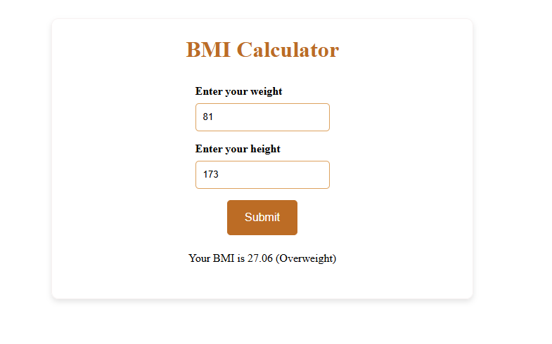

# Day-5-BMI-Calculator

A simple and interactive **BMI (Body Mass Index) Calculator** built using **HTML, CSS, and JavaScript**.

This project calculates BMI based on user input (height in cm and weight in kg) and displays the BMI value along with the health category.

---

## 🚀 Live Features

- Accepts height (in cm)
- Accepts weight (in kg)
- Calculates BMI instantly
- Displays BMI value up to 2 decimal places
- Shows BMI category:
  - Underweight
  - Normal
  - Overweight
  - Obese
- Simple and clean UI
